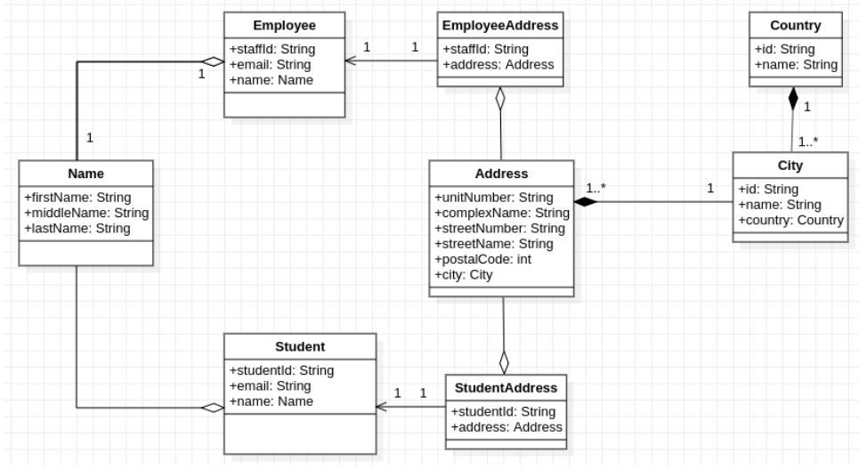

# Problem Statement
In the quest for seamless and effective organisational processes in a college, the technology
department of the college has been given the task to digitize and automate its academic-facing
processes.
The technology department has decided to use Domain Driven Design to actualize this. A section of
the technology team was given the responsibility to solicit requirements based on the as-is processes.
Thus, after many analysis meetings, they have come up with a domain model. A section of the domain
model is presented below.

# UML Diagram

# Discussion

## Flaws
- Students may share an address (UML depicts a one-to-one relationship)
- Address should be an entity with an identifier, to be able to use a bridging entity to make data access easy.
- All attributes have public access modifiers, data integrity identifiers (keys) should be protected or private.
- Employee and Student share the same properties and could have been combined to produce a single entity.
- Object nesting, Address has City and City has Country. This is problem when accessing data, it also does not conform to single responsibility.

## Improvements
 - Specifying the endpoints to be designed and defining proper requirements. Such as whether a client should be able to add a City or Country to the address or choose from a selection.
 - Similarly, EmployeeAddress or StudentAddress can be saved even though the relation Student or Employee do not exist.

# Authors
<table>
    <tbody>
        <tr>
            <td>
                <a href="https://github.com/CurstinJR">
                    </img>
                     
                    <b>Curstin   Rose</b>
                </a>
                 
                
            </td>
            <td>
                <a href="https://github.com/Erica-Ch">
                </img>
                 
                <b>Ngonidzashe Erica   Chipato</b>
                </a>
                 
                
            </td>
            <td>
                <a href="https://github.com/leokeke96">
                </img>
                 
                <b>Kevin Lionel Mombo   Ndinga</b>
                </a>
                 
                
            </td>
            <td>
                <a href="https://github.com/Niyonzima10">
                </img>
                 
                <b>Chantal Niyonzima</b>
                </a>
                 
                
            </td>
            <td>
                <a href="https://github.com/Tarren-Adams">
                </img>
                 
                <b>Tarren-Marc Adams</b>
                </a>
                 
                
            </td>
        </tr>
    </tbody>
</table>

## Built with:

- [Maven](https://maven.apache.org/) - Dependency Management
- [JUnit](https://junit.org/junit5/) - Testing Framework
- [Spring](https://spring.io/) - Application Framework

